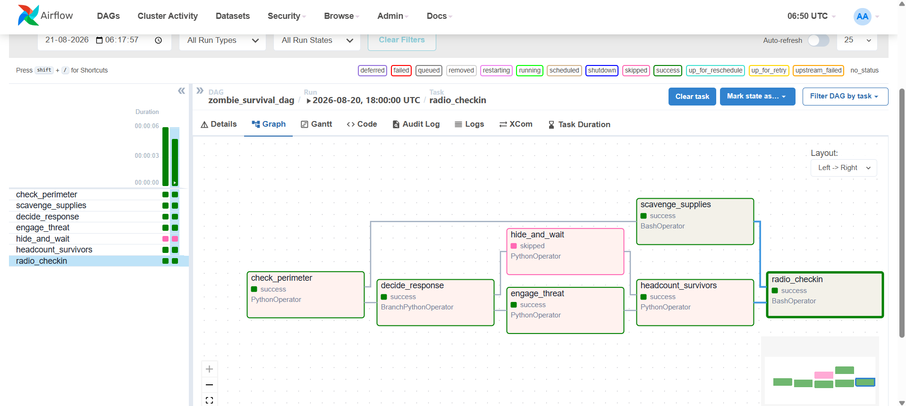
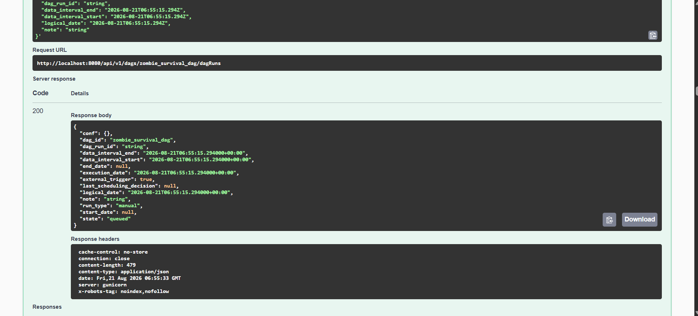
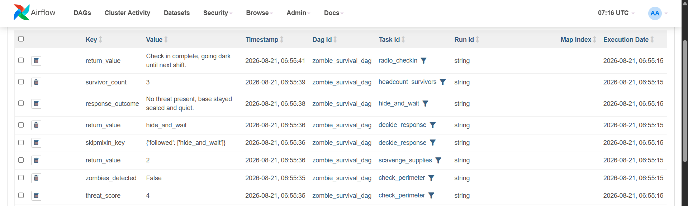

# Zombie Apocalypse Survival DAG

**Day 1: Automate or Die — Apache Airflow Assignment**

A recurring Apache Airflow pipeline that automates a small group's survival
routine: checking the perimeter, scavenging supplies, deciding whether to
fight or hide, taking a headcount, and radioing a status update to other
camps.

---

## Table of Contents

1. [Project Overview](#project-overview)
2. [Folder Structure](#folder-structure)
3. [Prerequisites](#prerequisites)
4. [Setup and Installation](#setup-and-installation)
5. [Task Flow](#task-flow)
6. [Data Passed via XCom](#data-passed-via-xcom)
7. [Skip Logic](#skip-logic)
8. [Schedule](#schedule)
9. [Coding Practices Followed](#coding-practices-followed)
10. [Triggering the DAG via the REST API](#triggering-the-dag-via-the-rest-api)
11. [Screenshots](#screenshots)
12. [Deliverables Checklist](#deliverables-checklist)
13. [Troubleshooting](#troubleshooting)

---

## Project Overview

The news called it "an isolated incident." Six hours later, the streets are
quiet in the worst possible way, and the only working computer left in the
bunker has Apache Airflow installed on it. This project scripts the
survival routine so it runs itself instead of a human having to remember
an eight step checklist every dawn and dusk.

The DAG contains seven tasks, mixes a `BashOperator` with several
`PythonOperator` tasks, branches based on a simulated threat score, passes
data between tasks with XCom, and deliberately skips one of two response
tasks depending on what the perimeter check finds.

---

## Folder Structure

```
zombie-survival-airflow/
├── docker-compose.yaml         Airflow services: postgres, webserver, scheduler, init
├── .env                        Sets AIRFLOW_UID for correct file permissions
├── README.md                   This file
├── dags/
│   └── zombie_survival_dag.py  The DAG itself
├── logs/                       Airflow writes task logs here (auto created)
├── plugins/                    Empty, reserved for custom Airflow plugins
├── config/                     Empty, reserved for extra Airflow config files
└── screenshots/
    ├── graph_view_completed_run.png       Graph view with the skipped task marked
    └── api_trigger_request_response.png   Postman or Swagger trigger request and response
```

Notes on each folder:

- **`dags/`** is the only folder Airflow actually scans for DAG files. Since
  `docker-compose.yaml` mounts this folder straight into the containers,
  any edit to `zombie_survival_dag.py` on your machine is picked up by the
  scheduler within about 20 seconds, no restart required.
- **`logs/`** starts out empty and fills up automatically once tasks run.
  You do not need to create anything inside it.
- **`plugins/`** and **`config/`** exist because the official Airflow
  Docker image expects them to be mounted, but this project does not use
  either one.
- **`screenshots/`** holds the two required deliverable images. See the
  [Screenshots](#screenshots) section for exact file names.

---

## Prerequisites

- Docker Desktop (Mac or Windows) or Docker Engine plus the Compose plugin
  (Linux), already installed and running.
- At least 4 GB of memory available to Docker.
- A terminal (Command Prompt, PowerShell, or a Mac/Linux shell).
- Postman, or just a browser, for triggering the DAG through the REST API.

---

## Setup and Installation

1. **Open a terminal inside the project folder.** Confirm you are in the
   right place by listing the folder contents. You should see
   `docker-compose.yaml` sitting directly in front of you, not inside
   another nested folder.

   ```
   cd zombie-survival-airflow
   ls          (Mac/Linux)
   dir         (Windows)
   ```

2. **Match the container user ID to your own, on Mac or Linux only.**

   ```
   id -u
   ```

   If the number printed is not `50000`, open `.env` and replace the value
   there with the number `id -u` printed. This avoids permission errors on
   the `dags`, `logs`, and `plugins` folders. Windows users can leave `.env`
   as it is.

3. **Run the one time initialization.** This creates the Airflow metadata
   database tables and an admin user.

   ```
   docker compose up airflow-init
   ```

   Wait for this command to finish and exit with code 0 before continuing.

4. **Start all services in the background.**

   ```
   docker compose up -d
   ```

5. **Wait about 30 to 60 seconds**, then open a browser to
   `http://localhost:8080`. Log in with:

   - Username: `airflow`
   - Password: `airflow`

6. **Find `zombie_survival_dag`** in the DAG list and unpause it using the
   toggle switch on the left. A paused DAG will not run even when
   triggered.

7. **Stop everything when you are done for the day.**

   ```
   docker compose down
   ```

   Add `-v` to that command only if you also want to delete the database
   volume and start completely fresh next time.

---

## Task Flow

```
                    ┌────────────────────┐
                    │  check_perimeter   │
                    │  (PythonOperator)  │
                    └─────────┬──────────┘
                              │
                ┌─────────────┴─────────────┐
                ▼                           ▼
   ┌────────────────────┐       ┌──────────────────────┐
   │  scavenge_supplies  │       │   decide_response     │
   │  (BashOperator)     │       │ (BranchPythonOperator) │
   └──────────┬──────────┘       └──────────┬─────────────┘
              │                             │
              │                 ┌───────────┴───────────┐
              │                 ▼                       ▼
              │      ┌────────────────────┐  ┌────────────────────┐
              │      │   engage_threat    │  │   hide_and_wait     │
              │      │  (PythonOperator)  │  │  (PythonOperator)   │
              │      └──────────┬─────────┘  └──────────┬──────────┘
              │                 └───────────┬────────────┘
              │                             ▼
              │                ┌────────────────────────┐
              │                │ headcount_survivors     │
              │                │  (PythonOperator)       │
              │                └────────────┬────────────┘
              │                             │
              └─────────────┬───────────────┘
                            ▼
                 ┌────────────────────┐
                 │   radio_checkin    │
                 │  (BashOperator)    │
                 └────────────────────┘
```

**Why it is designed this way**

The run starts with `check_perimeter`, which stands in for a scout checking
the fence line and produces a threat score. Right after that,
`scavenge_supplies` runs in parallel, since sending someone for food does
not depend on whether the perimeter is clear. The threat score then feeds
`decide_response`, a branch task that sends the run down exactly one of two
paths: `engage_threat` if the score is high enough to mean zombies were
spotted, or `hide_and_wait` if the area looks clear. Both paths lead into
`headcount_survivors`, which always runs regardless of which branch fired,
because you count your people no matter how the day went. The run finishes
with `radio_checkin`, which pulls together the supply count, the survivor
headcount, and the outcome of whichever response branch ran, and reports it
all to the other camps.

---

## Data Passed via XCom

| Producer task          | XCom key            | Consumed by                          | Why                                                              |
|-------------------------|----------------------|----------------------------------------|-------------------------------------------------------------------|
| `check_perimeter`        | `threat_score`        | `decide_response`, `engage_threat`, `hide_and_wait` | Lets the branch decide without re scanning the perimeter          |
| `check_perimeter`        | `zombies_detected`     | `decide_response`                      | The boolean flag that actually drives the branch decision         |
| `scavenge_supplies`      | return value (supply units) | `radio_checkin`                  | So the final report can mention stock levels without repeating the search |
| `engage_threat`          | `response_outcome`     | `radio_checkin`                       | Describes what happened if the fight branch ran                   |
| `hide_and_wait`          | `response_outcome`     | `radio_checkin`                       | Describes what happened if the hide branch ran                    |
| `headcount_survivors`    | `survivor_count`        | `radio_checkin`                       | So the final report can state exactly how many survivors are present |

---

## Skip Logic

`decide_response` is a `BranchPythonOperator`. When `zombies_detected` is
`true`, it returns the task ID `engage_threat`. When it is `false`, it
returns `hide_and_wait`. Airflow automatically marks whichever of the two
branch tasks was **not** returned as **skipped**, which is the deliberate
skip this assignment requires.

The logs inside `decide_response` spell out the exact threat score and the
threshold it was compared against, so anyone reading the logs later can
reconstruct exactly why the other branch never ran.

---

## Schedule

```
0 6,18 * * *
```

A survival routine does not happen once a day, it happens at shift change.
This cron expression runs the DAG at **06:00** for dawn patrol, before
anyone leaves the bunker, and again at **18:00** for dusk lockdown, before
nightfall. That matches how the group would realistically need to operate
far better than a plain `@daily` schedule would.

---

## Coding Practices Followed

- **Logging, not print** — every task uses `context["ti"].log` and moves
  through every log level from `debug` up to `critical`, especially to
  explain why a task was skipped.
- **Meaningful names** — task IDs and variables describe what they do,
  for example `check_perimeter`, `zombies_detected`, `survivor_count`.
- **No hardcoded values** — the threat engage threshold, minimum survivor
  headcount, and base callsign are all pulled from Airflow Variables with
  sensible defaults, rather than being baked directly into the code.
- **PEP8 compliant** — verified with `flake8` at a 100 character line
  limit.

---

## Triggering the DAG via the REST API

This is a **mandatory** deliverable. The DAG must be triggered through the
Airflow REST API, not the UI's Trigger DAG button.

**Option A: Swagger UI**

1. Open `http://localhost:8080/api/v1/ui` in your browser.
2. Authenticate with `airflow` / `airflow` when prompted.
3. Find `POST /dags/{dag_id}/dagRuns`, click **Try it out**.
4. Set `dag_id` to `zombie_survival_dag`.
5. In the request body, provide a unique run ID, for example:

   ```json
   {
     "dag_run_id": "manual_zombie_run_1"
   }
   ```

6. Click **Execute** and confirm the response shows a `dag_run_id` and a
   `state` such as `"queued"`.

**Option B: Postman**

- Method: `POST`
- URL: `http://localhost:8080/api/v1/dags/zombie_survival_dag/dagRuns`
- Authorization: Basic Auth, username `airflow`, password `airflow`
- Body (raw, JSON):

  ```json
  {
    "dag_run_id": "manual_zombie_run_1"
  }
  ```

Take a screenshot of both the request you sent and the response you
received, and save it as described below.

---

## Screenshots

Two screenshots are required deliverables for this assignment. Save them
into the `screenshots/` folder using exactly these file names so they
render automatically wherever this README is viewed.

### 1. Graph view of a completed run

This shows the full task graph after a run has finished, with one of
engage_threat or hide_and_wait clearly marked as skipped.



### 2. API trigger request and response

This shows the DAG being triggered through the Airflow REST API
(Swagger UI), not the UI's Trigger DAG button, along with
the response containing the run identifier and its state.



### 3. XCOM

